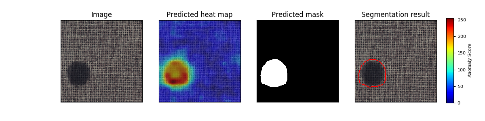
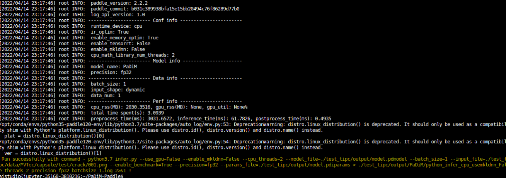

# PaDiM-Paddle

## 1 简介
This is the unofficial code based on **PaddlePaddle** of paper:<br>
[PaDiM: a Patch Distribution Modeling Framework for Anomaly Detection and Localization](https://arxiv.org/pdf/2011.08785)


PaDiM是一种基于图像Patch的算法。它依赖于预先训练好的CNN功能提取器。
将图像分解为多个面片，并使用不同的特征提取层从每个面片中提取嵌入。
将不同层次的激活向量串联起来，得到包含不同语义层次和分辨率信息的嵌入向量。这有助于对细粒度和全局上下文进行编码。
然而，由于生成的嵌入向量可能携带冗余信息，因此使用随机选择来降低维数。
在整个训练批次中，为每个面片嵌入生成一个多元高斯分布。因此，对于训练图像集的每个面片，我们有不同的多元高斯分布。这些高斯分布表示为高斯参数矩阵。
在推理过程中，使用马氏距离对测试图像的每个面片位置进行评分。它使用训练期间为面片计算的协方差矩阵的逆矩阵。
马氏距离矩阵形成了异常图，分数越高表示异常区域。
本项目基于PaddlePaddle框架复现了STFPM，并在MvTec数据集上进行了实验。

**论文：**
- [1]  Simonjan, Jennifer  and  Unluturk, Bige D.  and  Akyildiz, Ian F. [PaDiM: a Patch Distribution Modeling Framework for Anomaly Detection and Localization](https://arxiv.org/pdf/2011.08785)

**项目参考：**
- [anomalib](https://github.com/openvinotoolkit/anomalib/tree/development/anomalib/models/padim)
- [PaDiM-Anomaly-Detection-Localization-master](https://github.com/xiahaifeng1995/PaDiM-Anomaly-Detection-Localization-master)

## 2 复现精度
>在MvTec数据集的测试效果如下表。


### Image-Level AUC

|                |  Avg  | Carpet | Grid  | Leather | Tile  | Wood  | Bottle | Cable | Capsule | Hazelnut | Metal Nut | Pill  | Screw | Toothbrush | Transistor | Zipper |
| -------------- | :---: | :----: | :---: | :-----: | :---: | :---: | :----: | :---: | :-----: | :------: | :-------: | :---: | :---: | :--------: | :--------: | :----: |
| anomalib      | 0.891 | 0.945  | 0.857 |  0.982  | 0.950 | 0.976 | 0.994  | 0.844 |  0.901  |  0.750   |   0.961   | 0.863 | 0.759 |   0.889    |   0.920    | 0.780  |
| Paddle | 0.922 | 0.998  |  0.915 |  1.000  | 0.941 | 0.984 | 0.999  | 0.854 |  0.854  |  0.848  |   0.978   | 0.881 | 0.777 |    1.000     |   0.952    | 0.862  |

### Pixel-Level AUC

|                |  Avg  | Carpet | Grid  | Leather | Tile  | Wood  | Bottle | Cable | Capsule | Hazelnut | Metal Nut | Pill  | Screw | Toothbrush | Transistor | Zipper |
| -------------- | :---: | :----: | :---: | :-----: | :---: | :---: | :----: | :---: | :-----: | :------: | :-------: | :---: | :---: | :--------: | :--------: | :----: |
| anomalib     | 0.968 | 0.984  | 0.918 |  0.994  | 0.934 | 0.947 | 0.983  | 0.965 |  0.984  |  0.978   |   0.970   | 0.957 | 0.978 |   0.988    |   0.968    | 0.979  |
| Paddle | 0.961 |0.989  | 0.941 |  0.988  | 0.889 | 0.929 | 0.978  | 0.951 |  0.982  |  0.973   |   0.955   | 0.942 | 0.974 |   0.985    |   0.965    | 0.979  |

image-level auc的Mean为0.922。

pixel-level auc的Mean为0.961, 误差0.007，在误差允许范围内。


训练日志：[logs](logs/)
AIStudio预训练权重和日志：[AIStudio预训练权重](https://aistudio.baidu.com/aistudio/datasetdetail/139041)

## 3 数据集
数据集网站：[MvTec数据集](https://www.mvtec.com/company/research/datasets/mvtec-ad/)

AiStudio上的数据集：[MVTec-AD](https://aistudio.baidu.com/aistudio/datasetdetail/116034)

这里采用AiStudio上的数据集上的数据集，下载后用如下命令解压到自己指定的**PATH/MVTec路径**下：
```shell
tar xvf mvtec_anomaly_detection.tar.xz
```

## 4 环境依赖
- 硬件: Tesla V100 16G >= 1

- 框架:
    - PaddlePaddle >= 2.2.0
    
## 快速开始

### 第一步：克隆本项目
```bash
# clone this repo
git clone git@github.com:CuberrChen/PaDiM-Paddle.git
cd PaDiM-Paddle
```

### 第二步：训练模型
MVTec共有15个类别的子数据集，因此每个类别都需要单独训练一个模型；
在训练时，通过category参数来指定类别数据进行训练。data_path指定上述数据集路径**PATH/MVTec** 。
val表示是否在训练时开启指标计算。save_path指定模型保存路径，会在这个路径下生成category的目录。
seed表示随机数种子，这里根据给定参考项目取`42`.

开始训练：
以carpet为例：
```bash
python train.py --data_path=PATH/MVTec/ --category carpet  --val=True --save_path=./output --seed 42
```

注意：由于这个算法不需要优化，所有没有学习率和损失log。

### 第三步：验证
需要指定训练好的模型参数路径`model_path=output/carpet/best.pdparams`
```bash
python val.py --data_path=PATH/MVTec/ --category carpet  --model_path=./output/carpet/best.pdparams --save_picture=True --save_path=./output --seed 42
```

### 第四步：预测
这里需要指定单张图片路径picture_path以及保存预测结果路径save_path，会在生成预测结果predict.png
```shell
python predict.py --picture_path=PATH/MVTec/carpet/test/color/000.png --category carpet  --model_path=./output/carpet/best.pdparams --save_picture=True --save_path=predict.png --seed 42
```

如下：




### 第五步：TIPC

**详细日志在[test_tipc/output](test_tipc/output/STFPM)**

TIPC: [TIPC: test_tipc/README.md](test_tipc/README.md)

首先安装auto_log，需要进行安装，安装方式如下：
auto_log的详细介绍参考https://github.com/LDOUBLEV/AutoLog。
```shell
git clone https://github.com/LDOUBLEV/AutoLog
cd AutoLog/
pip3 install -r requirements.txt
python3 setup.py bdist_wheel
pip3 install ./dist/auto_log-1.2.0-py3-none-any.whl
```
进行TIPC：
```bash
bash test_tipc/prepare.sh test_tipc/configs/PaDiM/train_infer_python.txt 'lite_train_lite_infer'

bash test_tipc/test_train_inference_python.sh test_tipc/configs/PaDiM/train_infer_python.txt 'lite_train_lite_infer'
```
TIPC结果：

**tipc测试结果截图**




- 预训练模型的静态图导出与推理测试：

```shell
python export_model.py --depth 18 --img_size=224 --model_path=./test_tipc/output/carpet/best.pdparams --save_dir=./test_tipc/output
```
注意：由于该算法并不训练模型，仅仅由预训练模型生成数据分布数据，因此导出分为两个部分，一部分是预训练模型（`model.pdiparams,model.pdmodel`），一部分是分布数据(`distribution`)。

```shell
python infer.py --use_gpu=True --model_file=./test_tipc/output/model.pdmodel --input_file=./test_tipc/data/capsule/test/crack/001.png --params_file=./test_tipc/output/model.pdiparams --category=carpet  --distribution=./test_tipc/output/distribution
```
可正常导出与推理。

注意：
- 由于算法本身对于数据精度，也就是小数点位数异常敏感（不同小数点位数，算出来的分布匹配情况是不一样的，导致即使可以导出推理，**backbone特征提取数据一致,后处理代码一模一样的情况下其结果会与动态图也不一致**。因此该算法并不适合动静态转换）
- test_tipc时的infer，由于test_tipc限制了可视化环境。开启可视化会报错。注释掉infer 377行。

## 5 代码结构与说明
**代码结构**
```
├── data
├── datasets
├── models
├── logs
├── output
├── test_tpic
├── README.md
├── train.py
├── val.py   
├── predict.py
├── export_model.py
├── infer.py
└── requirements.txt              
```

## 6 模型信息

相关信息:

| 信息 | 描述 |
| --- | --- |
| 作者 | xbchen|
| 日期 | 2022年4月 |
| 框架版本 | PaddlePaddle==2.2.1 |
| 应用场景 | 异常检测 |
| 硬件支持 | GPU、CPU |
| 在线体验 | [notebook](https://aistudio.baidu.com/aistudio/projectdetail/3810216?contributionType=1)|

## 7 说明

- 感谢百度提供的算力支持。